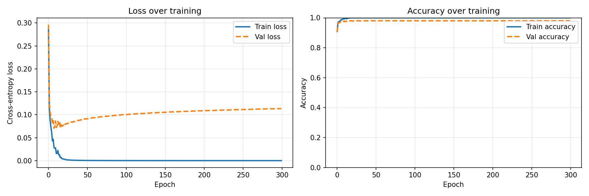
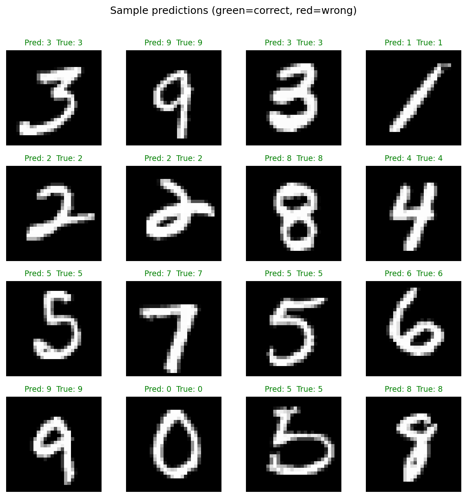
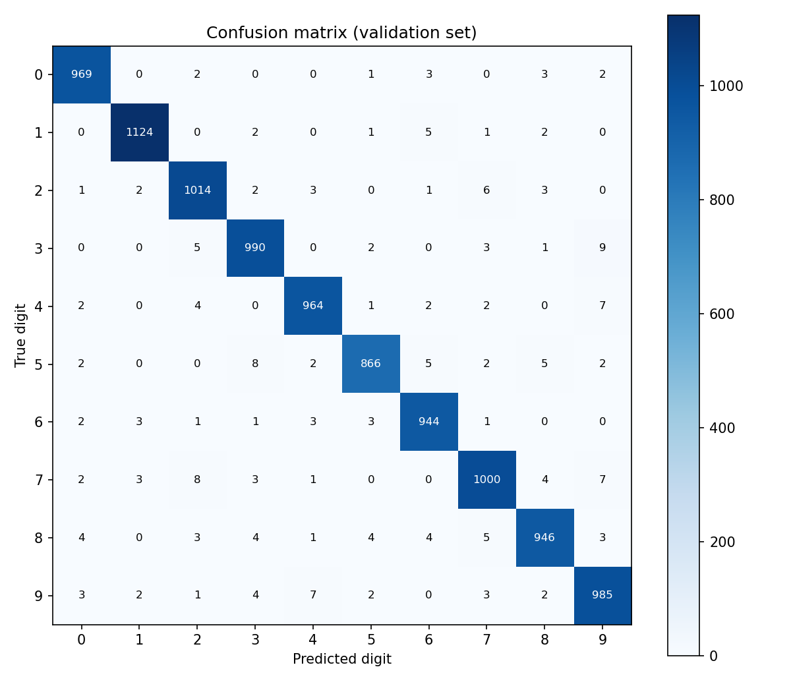

# Neural Network from Scratch

A fully connected feedforward neural network implemented in **pure NumPy** — no PyTorch, no TensorFlow, no sklearn. Every operation (forward pass, backpropagation, gradient descent) is derived and implemented from first principles.

Trained on **MNIST handwritten digits**. Achieves **97.98% validation accuracy**.

---

## Why from scratch?

Calling `sklearn.MLPClassifier()` takes one line. This project takes 250 lines — because the goal is to understand exactly what's happening mathematically, not just get a number out. Every line of code corresponds directly to a piece of the math.

---

## Architecture

```
Input         Hidden 1      Hidden 2      Output
784 neurons → 128 neurons → 64 neurons → 10 neurons
(28×28 px)    (ReLU)        (ReLU)        (Softmax)
```

Weight matrix shapes:
- W¹: (128, 784)
- W²: (64, 128)  
- W³: (10, 64)

---

## Key concepts implemented

- **Forward pass** — matrix multiplication chain: Z = Wx + b, A = activation(Z)
- **Backpropagation** — chain rule applied layer by layer to compute ∂L/∂W for each weight matrix
- **Softmax + cross-entropy loss** — the output gradient simplifies elegantly to A − Y
- **ReLU derivative** — binary mask: gradient flows where Z > 0, blocked where Z ≤ 0
- **He initialization** — weights scaled by √(2/fan_in) to prevent vanishing/exploding gradients
- **Mini-batch SGD** — training on batches of 64 rather than full dataset; data reshuffled each epoch

---

## Results

| Metric | Value |
|---|---|
| Validation accuracy | **97.98%** |
| Train accuracy | 100% |
| Epochs | 300 |
| Batch size | 64 |
| Learning rate | 0.1 |

### Training curves



The divergence between train and val loss after ~epoch 20 is classic overfitting — the network memorized training data after learning all genuine patterns. Early stopping at epoch 20 would preserve the best generalization.

### Sample predictions



### Confusion matrix



Most common confusions: **4↔9**, **3↔8**, **7↔1** — digits that share visual structure. These are the same pairs humans find ambiguous.

---

## How to run

```bash
pip install numpy matplotlib scikit-learn
python train.py
```

MNIST downloads automatically on first run (~30 seconds). Training takes ~10 minutes on CPU. Weights are saved to `model_weights.npz` after training.

---

## File structure

```
├── neural_network.py   # The network: forward pass, backprop, weight updates
├── train.py            # Data loading, training loop, evaluation, plots
├── model_weights.npz   # Saved weights (generated after training)
├── training_curves.png # Loss and accuracy over epochs
├── sample_predictions.png
└── confusion_matrix.png
```

---

## What I'd add next

- **Early stopping** — halt training when val loss stops improving
- **Dropout** — randomly zero neurons during training to reduce overfitting
- **Adam optimizer** — adaptive learning rates per parameter; faster convergence than vanilla SGD
- **Momentum** — smooth gradient updates to escape noisy local minima

---

*Built as a deep-learning fundamentals project. USC Applied & Computational Mathematics.*
